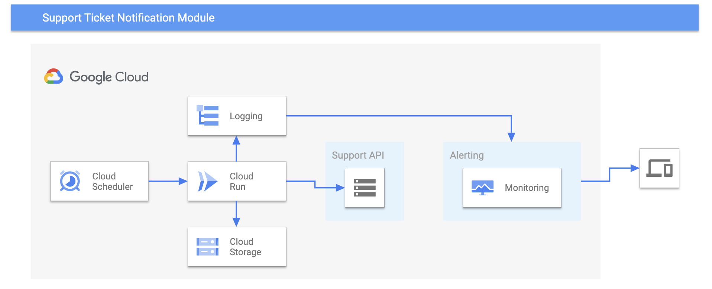

<!--
Copyright 2023 Google LLC

Licensed under the Apache License, Version 2.0 (the "License");
you may not use this file except in compliance with the License.
You may obtain a copy of the License at

     https://www.apache.org/licenses/LICENSE-2.0

Unless required by applicable law or agreed to in writing, software
distributed under the License is distributed on an "AS IS" BASIS,
WITHOUT WARRANTIES OR CONDITIONS OF ANY KIND, either express or implied.
See the License for the specific language governing permissions and
limitations under the License.
-->
# GCP Cloud Run Module for Support Case Creation Notifications
Containerized notification system for whenever a new support case is opened within your project or organization. The Cloud Scheduler will run every 10 minutes by default, triggering the Cloud Run job. The Cloud Run job will check if there are any new support cases and trigger the alerting policy, which will send a notification to the user. 

## Disclaimer

1. This is not an officially supported Google product.
2. Proper testing should be done before running this tool in production.
3. Standard, Enhanced, or Premium support must be enabled for case creation and Support API usage
4. This solution assumes that the user has been assigned the appropriate IAM roles

## Licensing
This sample code is made available under Apache 2 license. See the [LICENSE](./LICENSE) file for more details.

## GCP Costs
1. [Cloud Run Invocation](https://cloud.google.com/run/pricing#tables), usually free 
2. [Cloud Scheduler Jobs](https://cloud.google.com/scheduler/pricing) for running the script in intervals.
3. [Customer Care pricing](https://cloud.google.com/support) for Standard, Enhanced, or Premium Support
4. [Cloud Logging and monitoring](https://cloud.google.com/stackdriver/pricing) for alerts when a new case is opened.
5. [Cloud Storage](https://cloud.google.com/storage/pricing) for retrieval and writing to a textfile stored in storage.

## Installation Instructions
### Prerequisites
1. Clone the git repo using `git clone REPO`
2. In the Configuration.yaml file:
    - Replace the "example-project-id" with your project ID
    - Replace the "example-org-id" with your organization ID
    - If you would like to receive notifications from new support cases at the project level, replace the False with True. Otherwise, if you would like to receive notifications from new support cases at the organization level, leave it as False. 
3. Allow execution permissions with `chmod +x setup.sh build.sh deploy.sh ListProjects.sh`
4. Export the project ID `export PROJECT_ID=$(gcloud config get-value project)`
5. Creating a notification channel (skip this step if you already have a notification channel you would like to use):
    - Update the "example@example.com" with your email in `emailNotification.json` file 
    - Run `gcloud beta monitoring channels create --channel-content-from-file="emailNotification.json"`
6. Update the alert policy:
    - List the alerts with `gcloud alpha monitoring channels list`
    - Replace the "notificationsChannel" value (line 26) with the name of the notification channel you would like to use
7. (Optional) Change the frequency that the script is run. The script runs every 10 minutes by default
    - In deploy.sh change the FREQUENCY variable (line 18)

### Run the scripts
1. Setup the service accounts and permissions by running `./setup.sh [ORGANIZATION_ID]` (Replace with your organization ID)
2. Containerize the application by running `./build.sh`
3. Deploy and create the alerting policy by running `./deploy.sh`

You're done! You will receive notifications whenever a new support case is opened. 
